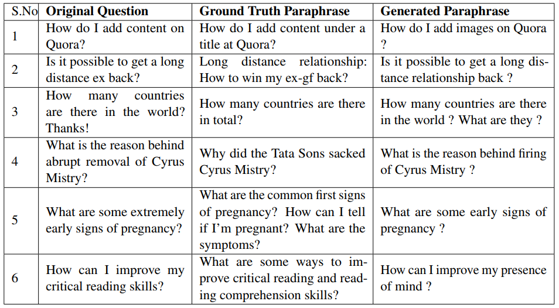
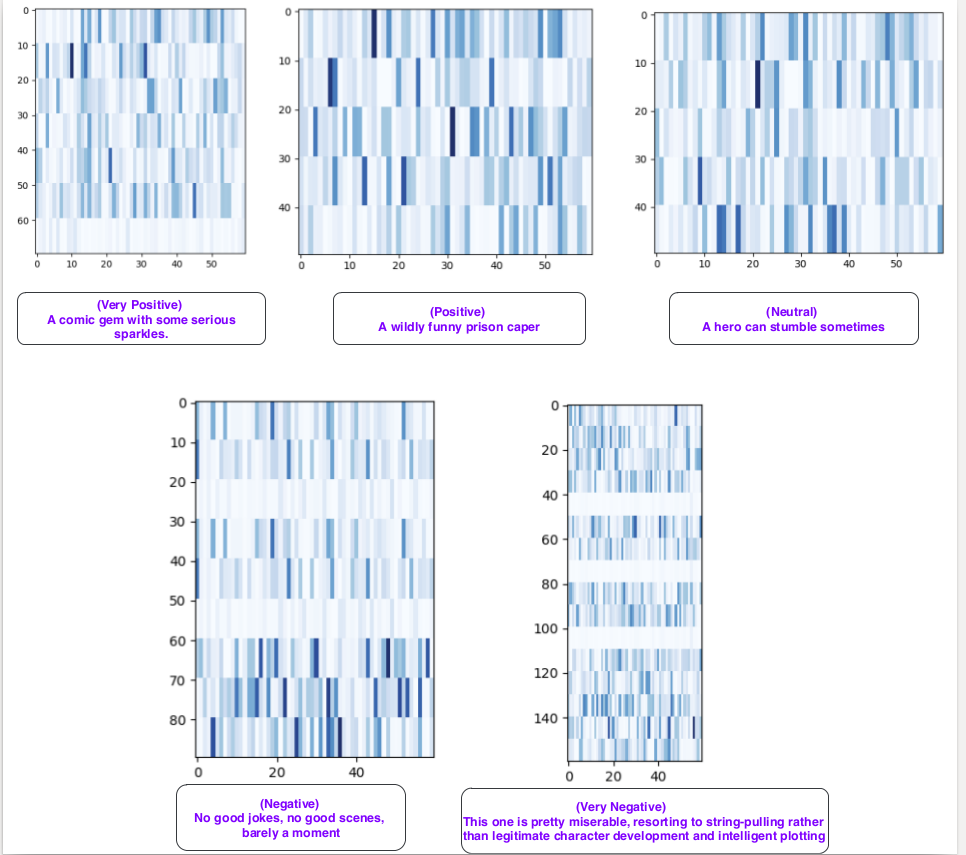

# Question-Paraphrases: Learning Semantic Sentence Embeddings using Pair-wise Discriminator

-- [[Project Page](https://badripatro.github.io/Question-Paraphrases/)]

-- [[Paper](http://aclweb.org/anthology/C18-1230)]

-- [[Code](https://github.com/badripatro/PQG/)]

 
## Main

 

## Result

 

 

 

