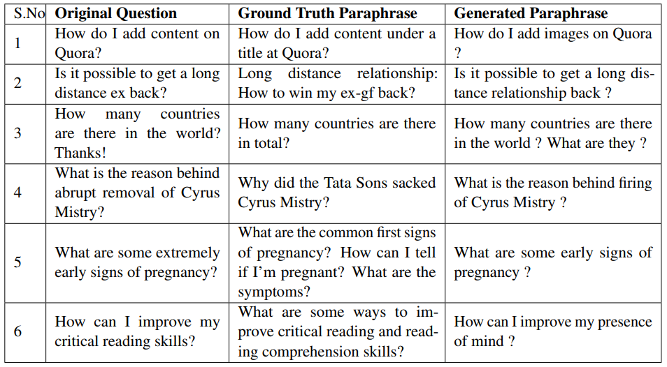
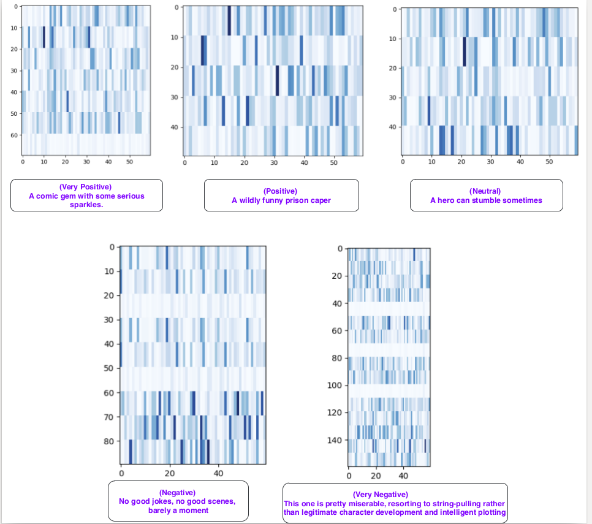

## [Learning Semantic Sentence Embeddings using Pair-wise Discriminator](https://arxiv.org/abs/1806.00807)
Badri N. Patro* ,Vinod K. Kurmi* ,Sandeep Kumar*, Vinay P. Namboodiri

## Link for [Code](https://github.com/badripatro/PQG/)


## Inroduction
 

## Main Model
 

## Results on question paraphrase generation
 

## Results on Sentiment Analysis
 


### Reference

```
@inproceedings{patro2018learning,
  title={Learning Semantic Sentence Embeddings using Sequential Pair-wise Discriminator},
  author={Patro, Badri Narayana and Kurmi, Vinod Kumar and Kumar, Sandeep and Namboodiri, Vinay},
  booktitle={Proceedings of the 27th International Conference on Computational Linguistics},
  pages={2715--2729},
  year={2018}
}
```


