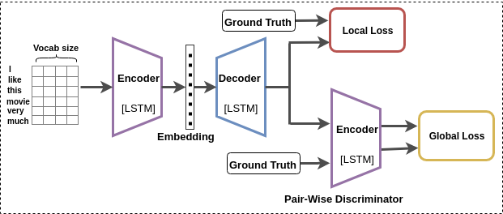

## Learning Semantic Sentence Embeddings using Pair-wise Discriminator
Badri N. Patro* ,Vinod K. Kurmi* ,Sandeep Kumar*, Vinay P. Namboodiri

## Code are available [Repo](https://github.com/badripatro/PQG/)

## Inroduction
 

## Main Model
 

## Results on Sentimental Analysis
 

### Motivation
-   We propose a model for obtaining sentence embeddings for solving the paraphrase generation task using a pair-wise discriminator loss added to an encoder-decoder network.
-   We show that these embeddings can also be used for the sentiment analysis task.
-   We validate the model using standard datasets with a detailed comparison with state-of-the-art methods and also ensure that the results are statistically significant.

